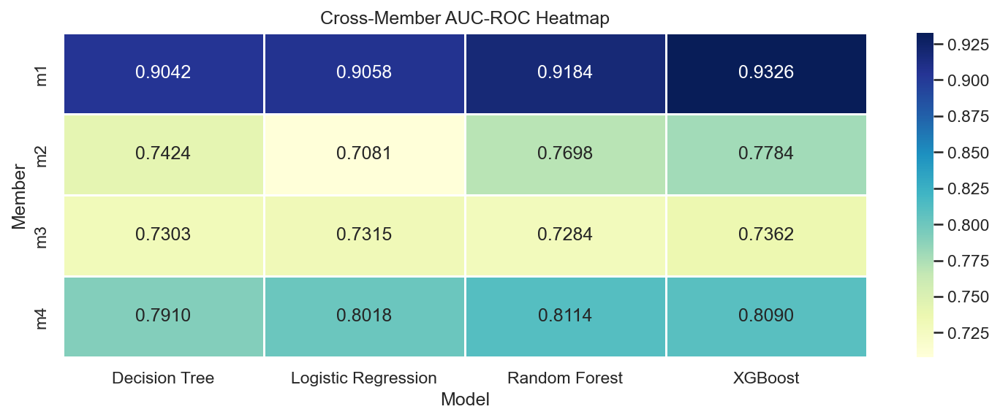
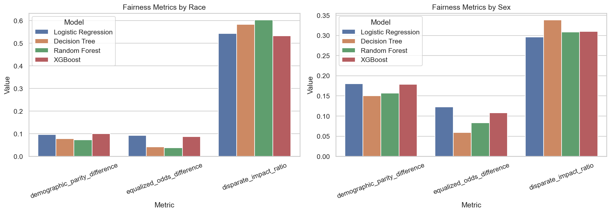
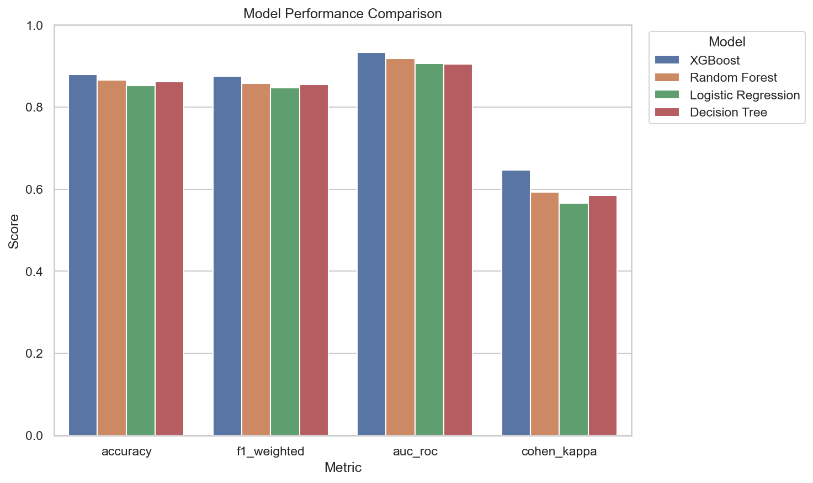
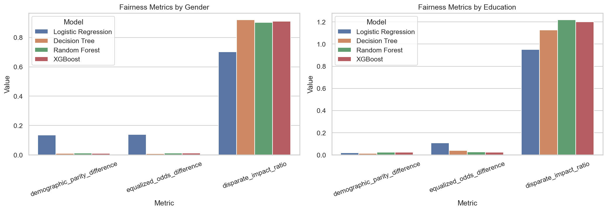
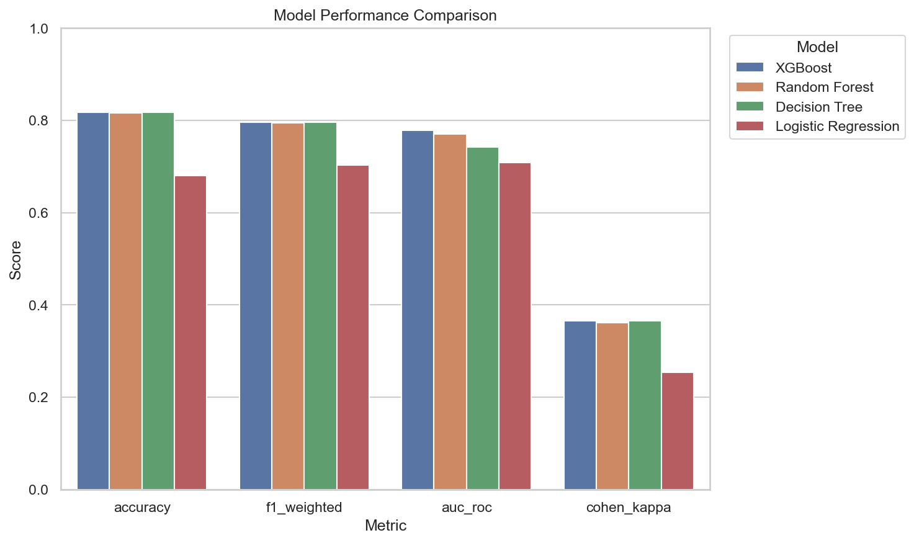
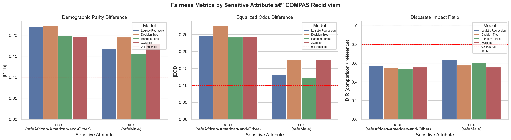
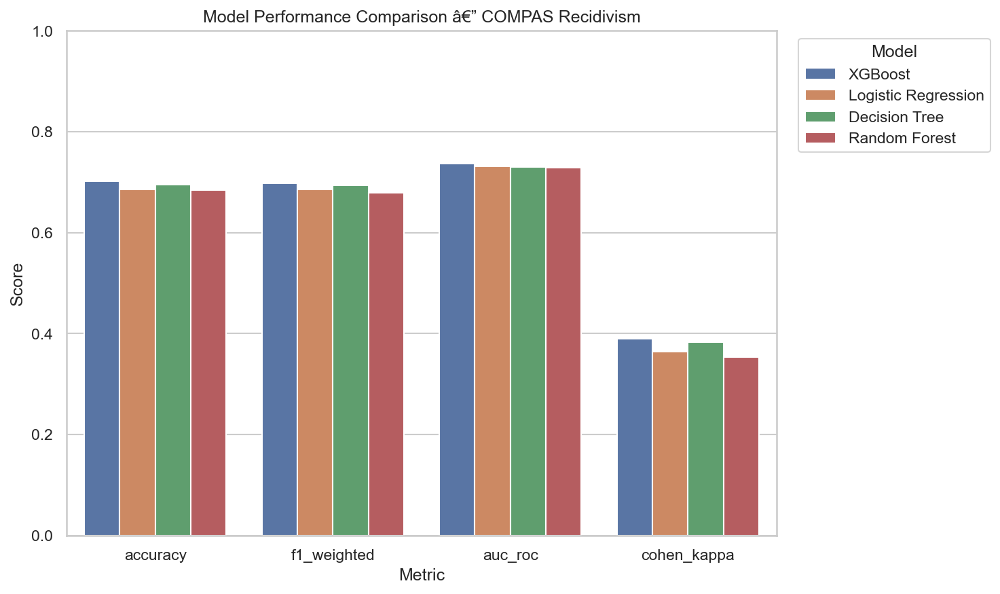

# Algorithmic Fairness in Machine Learning

[](https://www.python.org/)
[](LICENSE)
[](https://www.ncirl.ie/)
[](paper/)

Four real-world datasets. Four classifiers each. Eight protected-attribute evaluations. This project examines where standard ML metrics flatter and fairness metrics expose what accuracy hides.

> **Short answer to the big question:** every dataset in this study showed demographic disparities that fell below the 4/5ths (0.8) regulatory threshold. The highest-performing model was not the fairest. High AUC coexisted with severe fairness violations in three of four cases.

---

## Research Questions

1. **Do production-grade ML classifiers trained on real-world tabular data encode measurable demographic disparities?**
2. **Do standard performance metrics — AUC-ROC, accuracy, F1 — conceal fairness failures that only surface under dedicated fairness evaluation?**
3. **When three operationalisations of fairness conflict (demographic parity, equalised odds, disparate impact), which is most sensitive to each type of disparity?**
4. **Is the highest-performing classifier also the most equitable across protected groups?**

---

## Key Findings

### The short version

- Every dataset produced disparate impact ratios below 0.8 (the regulatory "four-fifths rule") for at least one protected attribute and classifier.
- Adult Income (M1): females were predicted above the income threshold at roughly **one-third** the rate of males (DI = 0.30–0.34 across all four models).
- COMPAS (M3): African-American defendants were assigned recidivism risk at roughly **double** the rate of Caucasian defendants across all models.
- Credit Default (M4): XGBoost assigned older borrowers a default probability approximately **8×** that of younger borrowers (DI = 0.123) — the most extreme disparity in the study.
- Bank Marketing (M2) was the exception: tree-based models produced DI > 1.0 on education, meaning lower-education groups were predicted to subscribe *more* often — a counterintuitive reversal that the logistic model did not replicate.
- XGBoost achieved the best AUC-ROC in three of four datasets but was not the fairest model in any of them.

---

### Disparate Impact at a Glance

A ratio below **0.8** is the threshold used in US employment law (EEOC) and echoed across EU AI Act risk guidance. Ratios above 1.0 indicate the comparison group is favoured.

| Dataset | Protected Attribute | Reference Group | Comparison Group | LR | DT | RF | XGB |
|---|---|---|---|---|---|---|---|
| Adult Income (M1) | Sex | Male | Female | 0.296 | 0.338 | 0.309 | 0.310 |
| Adult Income (M1) | Race | White | Non-White | 0.544 | 0.584 | 0.603 | 0.533 |
| Bank Marketing (M2) | Education | Higher | Lower/Other | 0.951 | 1.127 | 1.219 | 1.200 |
| Bank Marketing (M2) | Gender | Male | Female | 0.703 | 0.920 | 0.902 | 0.911 |
| COMPAS (M3) | Race | Afr-Am + Other | Caucasian | 0.570 | 0.556 | 0.538 | 0.557 |
| COMPAS (M3) | Sex | Male | Female | 0.641 | 0.577 | 0.603 | 0.557 |
| Credit Default (M4) | Age | Older (≥40) | Younger (<40) | 0.220 | 0.137 | 0.141 | 0.123 |
| Credit Default (M4) | Marital Status | Single/Divorced | Married | 0.771 | 0.778 | 0.695 | 0.755 |

**LR** = Logistic Regression · **DT** = Decision Tree · **RF** = Random Forest · **XGB** = XGBoost


---

### Standard Performance Summary

| Dataset | Task | Best Model | AUC-ROC | Accuracy | F1 Macro |
|---|---|---|---|---|---|
| Adult Income (M1) | Income > $50k | XGBoost | **0.933** | 87.9% | 82.3% |
| Bank Marketing (M2) | Term deposit subscription | XGBoost | 0.778 | 81.8% | 67.7% |
| COMPAS (M3) | Recidivism within 2 years | XGBoost | 0.736 | 70.2% | 69.3% |
| Credit Default (M4) | Credit card default | Random Forest | **0.811** | 90.2% | 64.9% |

Adult Income's AUC of 0.933 looks excellent in isolation. Paired with a sex-based DI of 0.296–0.338, it is a textbook example of how aggregate performance scores can obscure group-level inequity.



---

### Do fairness metrics agree with each other?

Not always. Bank Marketing education is the clearest case: logistic regression shows a demographic parity difference of 0.019 and an equalized odds difference of 0.108 — both in different directions from the tree-based models. The disparate impact ratio flips from below 1.0 (LR) to above 1.0 (RF, XGB), meaning the two model families disagree on which group is disadvantaged. This is not an anomaly — it reflects genuine tension between fairness definitions when class distributions differ between groups.

For a full breakdown of all three fairness metrics across all models and datasets, see [RESULTS.md](RESULTS.md) or download the CSVs from `data/results/`.

---

## Datasets

| ID | Dataset | Source | Rows | Task | Protected Attributes |
|---|---|---|---|---|---|
| M1 | Adult Census Income | [UCI ML Repository](https://archive.ics.uci.edu/dataset/2/adult) | ~48,800 | Binary income classification (>$50k) | Sex, Race |
| M2 | Bank Marketing | [UCI ML Repository](https://archive.ics.uci.edu/dataset/222/bank+marketing) | 41,188 | Binary subscription prediction | Education, Gender |
| M3 | COMPAS Recidivism | [ProPublica](https://github.com/propublica/compas-analysis) | 7,214 | Binary recidivism within 2 years | Race, Sex |
| M4 | Credit Card Default | [UCI ML Repository](https://archive.ics.uci.edu/dataset/350/default+of+credit+card+clients) | 30,000 | Binary default prediction | Age, Marital Status |

Raw data files are in `data/`. See [data/README.md](data/README.md) for column descriptions, cleaning decisions, and original sources.

---

## Results by Dataset

### M1 — Adult Census Income

**Research focus:** Sex and race disparities in income prediction. The Adult dataset has a well-known class imbalance (~76% ≤$50k) and reflects US Census data from 1994.

| Model | AUC-ROC | Accuracy | F1 Macro | Cohen κ |
|---|---|---|---|---|
| XGBoost | **0.933** | **87.9%** | **82.3%** | **0.647** |
| Random Forest | 0.918 | 86.6% | 79.5% | 0.593 |
| Decision Tree | 0.904 | 86.2% | 79.1% | 0.584 |
| Logistic Regression | 0.906 | 85.2% | 78.2% | 0.566 |

**Fairness — Sex (Male vs Female):**

| Model | DPD | EOD | DI Ratio |
|---|---|---|---|
| Logistic Regression | 0.181 | 0.123 | 0.296 |
| Decision Tree | 0.150 | 0.059 | 0.338 |
| Random Forest | 0.157 | 0.083 | 0.309 |
| XGBoost | 0.179 | 0.108 | 0.310 |

All four models fall far below the 0.8 threshold. The sex disparity is systematic, not model-specific.

**Fairness — Race (White vs Non-White):**

| Model | DPD | EOD | DI Ratio |
|---|---|---|---|
| Logistic Regression | 0.096 | 0.092 | 0.544 |
| Decision Tree | 0.078 | 0.042 | 0.584 |
| Random Forest | 0.073 | 0.038 | 0.603 |
| XGBoost | 0.100 | 0.087 | 0.533 |




---

### M2 — Bank Marketing

**Research focus:** Education and gender bias in term-deposit subscription prediction. The dataset is highly imbalanced (~89% non-subscription).

| Model | AUC-ROC | Accuracy | F1 Macro | Cohen κ |
|---|---|---|---|---|
| XGBoost | **0.778** | 81.8% | **67.7%** | **0.365** |
| Random Forest | 0.770 | 81.7% | 67.5% | 0.361 |
| Decision Tree | 0.742 | **81.8%** | 67.7% | 0.365 |
| Logistic Regression | 0.708 | 68.0% | 61.7% | 0.254 |

**Fairness — Education (Higher vs Lower/Other):**

| Model | DPD | EOD | DI Ratio |
|---|---|---|---|
| Logistic Regression | 0.019 | 0.108 | 0.951 |
| Decision Tree | −0.015 | 0.041 | 1.127 |
| Random Forest | −0.025 | 0.026 | 1.219 |
| XGBoost | −0.023 | 0.025 | 1.200 |

Negative DPD and DI > 1 indicate tree-based models favour the lower-education group — the only reversal in the study.

**Fairness — Gender (Male vs Female):**

| Model | DPD | EOD | DI Ratio |
|---|---|---|---|
| Logistic Regression | 0.135 | 0.140 | 0.703 |
| Decision Tree | 0.010 | 0.008 | 0.920 |
| Random Forest | 0.012 | 0.012 | 0.902 |
| XGBoost | 0.011 | 0.012 | 0.911 |

Logistic regression shows significantly worse gender fairness than the tree-based models on this dataset.




---

### M3 — COMPAS Recidivism

**Research focus:** Racial and sex disparities in recidivism risk scoring, replicating and extending the ProPublica analysis that first brought COMPAS into public debate.

| Model | AUC-ROC | Accuracy | F1 Macro | Cohen κ |
|---|---|---|---|---|
| XGBoost | **0.736** | **70.2%** | **69.3%** | **0.390** |
| Logistic Regression | 0.732 | 68.6% | 68.2% | 0.365 |
| Decision Tree | 0.730 | 69.6% | 69.1% | 0.383 |
| Random Forest | 0.728 | 68.5% | 67.4% | 0.354 |

**Fairness — Race (African-American + Other vs Caucasian):**

| Model | DPD | EOD | DI Ratio |
|---|---|---|---|
| Logistic Regression | 0.221 | 0.246 | 0.570 |
| Decision Tree | 0.223 | 0.276 | 0.556 |
| Random Forest | 0.199 | 0.242 | 0.538 |
| XGBoost | 0.196 | 0.243 | 0.557 |

The racial disparity in COMPAS is consistent across all classifiers: none approach the 0.8 threshold.

**Fairness — Sex (Male vs Female):**

| Model | DPD | EOD | DI Ratio |
|---|---|---|---|
| Logistic Regression | 0.169 | 0.132 | 0.641 |
| Decision Tree | 0.195 | 0.176 | 0.577 |
| Random Forest | 0.155 | 0.122 | 0.603 |
| XGBoost | 0.181 | 0.175 | 0.557 |




---

### M4 — Credit Card Default

**Research focus:** Age and marital-status disparities in credit default prediction. Contains 30,000 Taiwanese credit card holders, October 2005.

| Model | AUC-ROC | Accuracy | F1 Macro | Cohen κ |
|---|---|---|---|---|
| Random Forest | **0.811** | **90.2%** | 64.9% | 0.312 |
| XGBoost | 0.809 | 90.1% | **65.7%** | **0.325** |
| Logistic Regression | 0.802 | 83.4% | 68.5% | 0.379 |
| Decision Tree | 0.791 | 90.3% | 65.8% | 0.328 |

**Fairness — Age (Older ≥40 vs Younger <40):** ⚠️ Most extreme disparity in the study

| Model | DPD | EOD | DI Ratio |
|---|---|---|---|
| Logistic Regression | 0.639 | 0.586 | 0.220 |
| Decision Tree | 0.219 | 0.172 | 0.137 |
| Random Forest | 0.197 | 0.191 | 0.141 |
| XGBoost | 0.255 | 0.239 | **0.123** |

XGBoost's DI of 0.123 means older borrowers received a predicted default rate roughly 8× that of younger borrowers — the largest disparity found across all eight fairness evaluations in this study.

**Fairness — Marital Status (Single/Divorced vs Married):**

| Model | DPD | EOD | DI Ratio |
|---|---|---|---|
| Logistic Regression | 0.053 | 0.041 | 0.771 |
| Decision Tree | 0.011 | 0.005 | 0.778 |
| Random Forest | 0.014 | 0.019 | 0.695 |
| XGBoost | 0.013 | 0.014 | 0.755 |

---

## Reproducing the Analysis

**Requirements:** Python 3.8+

```bash
# Clone and install
git clone https://github.com/joshuajthomas/algorithmic-fairness-ml.git
cd algorithmic-fairness-ml
pip install -r requirements.txt

# Launch notebooks
jupyter notebook notebooks/
```

Run the notebooks in this order for full reproducibility:
1. `member1_adult_income.ipynb`
2. `member2_credit_default.ipynb`
3. `member3_compas_recidivism.ipynb`
4. `member4_bank_marketing.ipynb`
5. `group_synthesis.ipynb` — cross-dataset comparison (reads from `data/results/`)

All notebooks follow the CRISP-DM structure (`Business Understanding → Data Understanding → Data Preparation → Modelling → Evaluation → Deployment`) and use a shared modelling contract:
- `RANDOM_STATE = 42`, stratified 80/20 split
- `GridSearchCV` with `StratifiedKFold(n_splits=5)`
- Four classifiers: Logistic Regression, Decision Tree, Random Forest, XGBoost

See [group_notebook_contract.md](group_notebook_contract.md) for the full consistency contract.

---

## Downloading Data & Going Deeper

Everything produced by the analysis is in this repository and available to download directly from GitHub.

### Result CSVs

Pre-computed fairness and performance metrics for all models, ready for your own analysis:

```
data/results/
├── m1_standard_metrics.csv      # M1 performance (accuracy, AUC, F1, κ)
├── m1_fairness_race.csv         # M1 race fairness (DPD, EOD, DI)
├── m1_fairness_sex.csv          # M1 sex fairness
├── m2_standard_metrics.csv
├── m2_fairness_education.csv
├── m2_fairness_gender.csv
├── m3_standard_metrics.csv
├── m3_fairness_race.csv
├── m3_fairness_sex.csv
├── m4_standard_metrics.csv
├── m4_fairness_age.csv
└── m4_fairness_marital_status.csv
```

CSV schema — standard metrics:
```
model, accuracy, precision, sensitivity, specificity, f1_macro, f1_weighted, auc_roc, cohen_kappa
```

CSV schema — fairness metrics:
```
model, sensitive_attribute, reference_group, comparison_group,
positive_rate_reference, positive_rate_comparison,
demographic_parity_difference, equalized_odds_difference, disparate_impact_ratio
```

### Figures

All publication-quality figures are in `paper/figures/`:

```
paper/figures/
├── group_disparate_impact_heatmap.png   # Cross-dataset DI heatmap
├── group_auc_heatmap.png                # Cross-dataset AUC heatmap
├── m1_demographic_distributions.png
├── m1_income_by_demographics.png
├── m1_fairness_metrics.png
├── m1_performance_comparison.png
├── m2_demographic_distributions.png
├── m2_target_by_demographics.png
├── m2_fairness_metrics.png
├── m2_performance_comparison.png
├── m3_demographic_distributions.png
├── m3_recidivism_by_demographics.png
├── m3_fairness_metrics.png
├── m3_performance_comparison.png
└── m4_demographic_distributions.png
```

### Raw Datasets

| Dataset | Location | Format | Rows |
|---|---|---|---|
| Adult Census | `data/adult/` | `.data` / `.test` (CSV-like) | 48,842 |
| Bank Marketing | `data/bank_marketing/bank-additional/` | `.csv` | 41,188 |
| COMPAS | `data/compas/` | `.csv` | 7,214 |
| Credit Default | `data/credit_default/` | `.xls` | 30,000 |

See [data/README.md](data/README.md) for column descriptions, original sources, and the cleaning steps applied in each notebook.

---

## Paper & Slides

The written output is in `paper/`:

- **`IEEE_Fairness_Paper_humanized.docx`** — full IEEE-style research paper
- **`Fairness_Slides.pdf`** — presentation slides

Download directly from the [`paper/`](paper/) directory.

For the complete numerical results reference, see [RESULTS.md](RESULTS.md).

---

## Citation

If you use the code, data, or results from this project:

```bibtex
@misc{nci_fairness_2025,
  title     = {Algorithmic Fairness in Machine Learning: A Multi-Dataset Analysis},
  author    = {NCI Dublin MSc Artificial Intelligence Group},
  year      = {2025},
  publisher = {GitHub},
  url       = {https://github.com/joshuajthomas/algorithmic-fairness-ml}
}
```

Or see [CITATION.cff](CITATION.cff) for the full citation file.

---

## Project Structure

```
algorithmic-fairness-ml/
├── notebooks/
│   ├── member1_adult_income.ipynb
│   ├── member2_credit_default.ipynb
│   ├── member3_compas_recidivism.ipynb
│   ├── member4_bank_marketing.ipynb
│   └── group_synthesis.ipynb
├── data/
│   ├── adult/
│   ├── bank_marketing/
│   ├── compas/
│   ├── credit_default/
│   └── results/                  ← pre-computed CSVs (12 files)
├── paper/
│   ├── figures/                  ← 15 PNG figures
│   ├── IEEE_Fairness_Paper_humanized.docx
│   └── Fairness_Slides.pdf
├── RESULTS.md                    ← full metric breakdown
├── group_notebook_contract.md    ← consistency spec for all notebooks
├── requirements.txt
├── CITATION.cff
└── LICENSE
```

---

## License

[MIT](LICENSE) — data remains under its original licences (UCI: CC BY 4.0; COMPAS: ProPublica public release).
