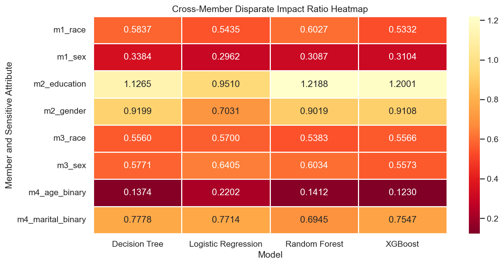

# Algorithmic Fairness in Machine Learning

MSc Artificial Intelligence research project auditing fairness and predictive performance across four high-stakes classification case studies.

This project compares standard ML performance with fairness metrics. It does **not** claim to prove real-world discrimination. It treats each dataset as a benchmark for understanding how model choices, protected attributes, and fairness definitions can produce different risk profiles.

## 30-Second Summary

- **Question:** are accurate ML classifiers necessarily fair when decisions affect income, credit, recidivism, or marketing outcomes?
- **Scope:** four datasets, four model families, standard metrics, and fairness metrics.
- **Models:** Logistic Regression, Decision Tree, Random Forest, and XGBoost.
- **Fairness metrics:** demographic parity difference, equalized odds difference, and disparate impact ratio.
- **Main finding:** accuracy and fairness do not move together reliably; the best-performing model is not automatically the safest model to deploy.



## Case Studies

| Case study | Prediction task | Protected attributes |
| --- | --- | --- |
| Adult Census | Income prediction | Race, sex |
| Credit Default | Default risk prediction | Gender, education |
| COMPAS | Recidivism risk prediction | Race, sex |
| Bank Marketing | Subscription/conversion prediction | Age, marital status |

## What To Inspect First

1. [`paper/figures/group_disparate_impact_heatmap.png`](paper/figures/group_disparate_impact_heatmap.png) for the main fairness-risk overview.
2. [`paper/figures/group_auc_heatmap.png`](paper/figures/group_auc_heatmap.png) for the performance comparison.
3. [`data/results/`](data/results/) for published standard and fairness metric CSVs.
4. [`notebooks/group_synthesis.ipynb`](notebooks/group_synthesis.ipynb) for the cross-case synthesis.
5. [`paper/IEEE_Fairness_Paper_humanized.docx`](paper/IEEE_Fairness_Paper_humanized.docx) and [`paper/Fairness_Slides.pdf`](paper/Fairness_Slides.pdf) for the report and presentation.

## Repository Structure

```text
notebooks/      Analysis notebooks for each case study and group synthesis
data/results/   Published standard metrics and fairness metrics
paper/          Report, slides, and result figures
requirements.txt
```

Raw datasets are intentionally excluded from this public repository. They must be obtained from their original sources before a full rerun. The repository keeps the notebooks, derived metrics, figures, and report so readers can inspect the analysis without redistributing source datasets.

## Reproduce

```bash
python3.11 -m venv .venv
source .venv/bin/activate
pip install -r requirements.txt
jupyter notebook notebooks/
```

Python 3.11 is recommended. Some scientific Python packages may not have wheels for very new Python releases yet.

Full notebook reruns require placing the original datasets back under the paths expected by the notebooks:

```text
data/adult/
data/credit_default/
data/compas/
data/bank_marketing/
```

The published CSVs in `data/results/` and figures in `paper/figures/` are included for review without rerunning the raw-data pipeline.

## Limitations

- This is a benchmark-style fairness audit, not a causal discrimination study.
- Fairness metrics can disagree because they encode different definitions of parity.
- Dataset labels and historical collection processes may contain their own biases.
- Results should be read as model-risk evidence, not as deployment approval.

## Author

Joshua Joenathan Thomas  
MSc Artificial Intelligence, National College of Ireland.
